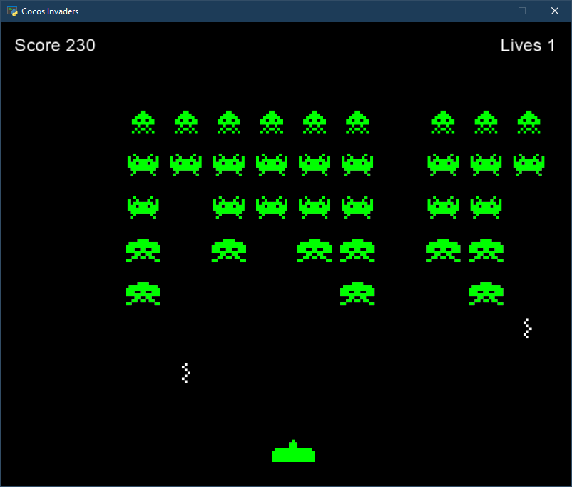

# Python Game Programming By Example
Code used in the book [Python Game Programming By Example](https://www.packtpub.com/game-development/python-game-programming-example) by Alejandro Rodas de Paz, and Joseph Howse

## Contents

### Hello Pong
Breakout implemented with Tkinter natively available with Python

### Cocos Invaders
Space invaders implemented with the Cocos2d package

##### Controls
* Arrow keys to move
* Space to shoot

##### Changes from the book
* Moved collision logic from Actor to GameLayer
* Added bunkers
* Added tests

### Tower Defense
A tower defense game implemented with the Cocos2d package, the map is created using Tiled

## Running the games
1. Change directory to a game folder e.g. `$cd CocosInvaders`
2. Create a virtual environment `$python -m venv venv`
3. Activate the virtual environment `$venv\Scripts\activate.bat`
4. Install the game's dependencies `$pip install -r dependencies.txt`
5. Run the main application e.g. `$python main.py`

## Running tests
1. Change directory to a game folder 
2. Run the test `python -m unittest discover`